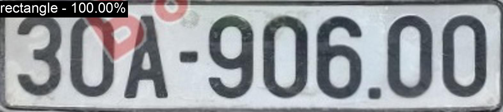
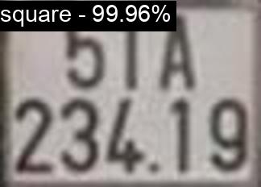

# License Plate Shape Classification

This project simply classifies whether license plate shape is **Square** or **Rectangle**

## Environments

- Python 3.10.6

Install requirements

``` bash
pip install -r requirements.txt
```

For more infomation, refer to [DEVICE.md](./DEVICE.md)

## Data

- I cannot public my data. You can use your own data or crawl from internet.

- Data in this format

``` files
|-- data
    |-- train
    |   |-- class 1
    |   |-- class 2
    |   `-- ...
    |-- valid
    |   |-- class 1
    |   |-- class 2
    |   `-- ...
    `-- test
        |-- class 1
        |-- class 2
        `-- ...
```

### Config

Modify infomation about training in `config.py`

### Train

Simply run 

``` bash
python train.py
```

### Experiment Results

Results after training 10 epochs

| Model       | Training Info | Best Accuracy | Pretrained              |
| ----------- |:-------------:| :-----------: | :---------------------: |
| Resnet18    | Adam, lr=1e-5 | 99.89%        | [Model](http://bit.ly/3PshMuc) |

You can download weight file above and put in `weights` folder and run inference

``` bash
python infer.py
```

#### Some inference results

- Rectangle Image



- Square Image

